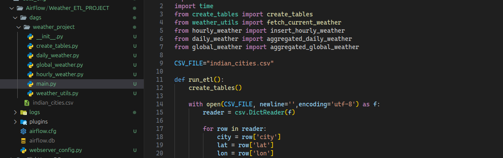
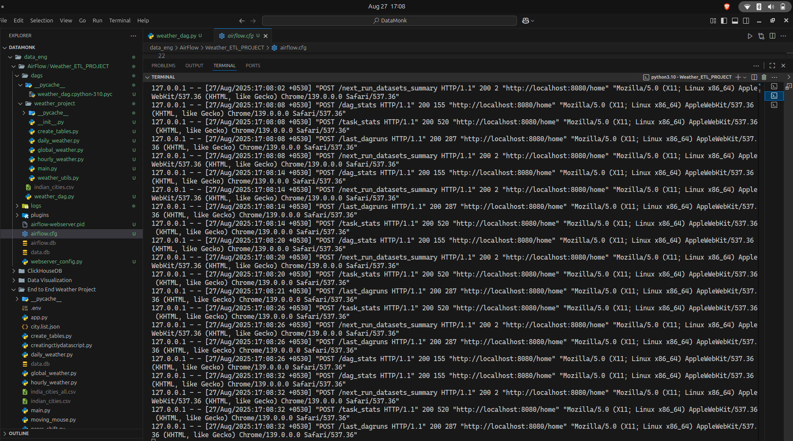

## Used Previous Project Code Only change the main.py with Weather_day.py file

```

from datetime import datetime, timedelta
from airflow import DAG
from airflow.operators.python import PythonOperator
import csv

# Import your existing functions
from weather_project.create_tables import create_tables
from weather_project.weather_utils import fetch_current_weather
from weather_project.hourly_weather import insert_hourly_weather
from weather_project.daily_weather import aggregated_daily_weather
from weather_project.global_weather import aggregated_global_weather

CSV_FILE = "./weather_project/indian_cities.csv"

# -----------------------
# Task functions
# -----------------------

def init_tables():
    create_tables()

def fetch_and_store_hourly():
    with open(CSV_FILE, newline='', encoding='utf-8') as f:
        reader = csv.DictReader(f)

        for row in reader:
            city = row['city']
            lat = row['lat']
            lon = row['lon']

            try:
                data = fetch_current_weather(lat, lon)
                temp = data['main']['temp']
                humidity = data['main']['humidity']
                weather_desc = data["weather"][0]["description"]
                country = data["sys"]["country"]
                dt = data["dt"]
                timezone_offset = data["timezone"]

                insert_hourly_weather(
                    city, lat, lon, temp, humidity, weather_desc, country, dt, timezone_offset
                )
                print(f"Stored {city} -> {temp}°C, {humidity}%, {weather_desc}")

            except Exception as e:
                print(f"Error fetching {city}: {e}")

def aggregate_daily():
    aggregated_daily_weather()

def aggregate_global():
    aggregated_global_weather()

# -----------------------
# DAG definition
# -----------------------

default_args = {
    "owner": "airflow",
    "retries": 1,
    "retry_delay": timedelta(minutes=5),
}

with DAG(
    dag_id="weather_etl_dag",
    default_args=default_args,
    description="Weather ETL DAG for Indian Cities",
    schedule_interval="@hourly",  # runs every hour
    start_date=datetime(2025, 1, 1),
    catchup=False,
    tags=["weather", "etl"],
) as dag:

    # Tasks
    t1 = PythonOperator(
        task_id="create_tables",
        python_callable=init_tables,
    )

    t2 = PythonOperator(
        task_id="fetch_hourly_weather",
        python_callable=fetch_and_store_hourly,
    )

    t3 = PythonOperator(
        task_id="aggregate_daily_weather",
        python_callable=aggregate_daily,
    )

    t4 = PythonOperator(
        task_id="aggregate_global_weather",
        python_callable=aggregate_global,
    )

    # Dependencies
    t1 >> t2 >> t3 >> t4


```






