# PART 1 - Getting Started With Matplotlib & Seaborn

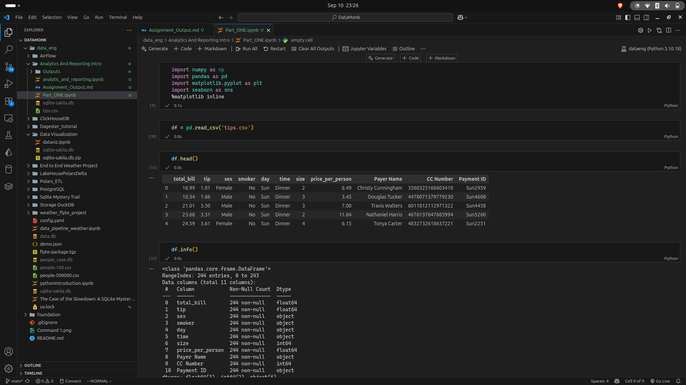
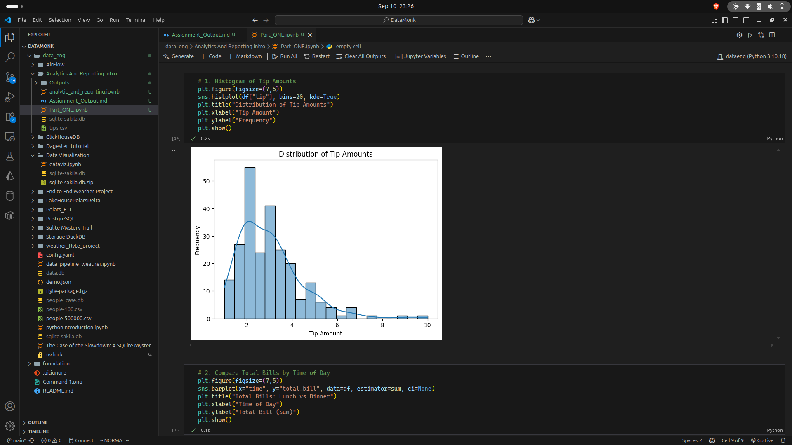
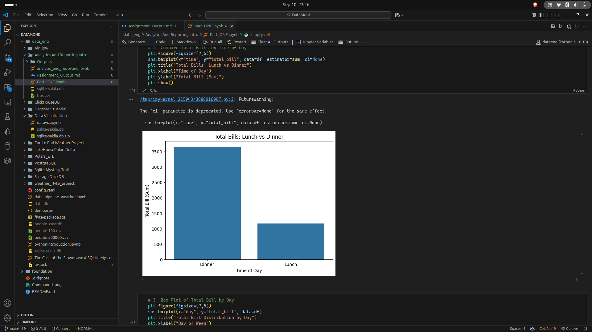
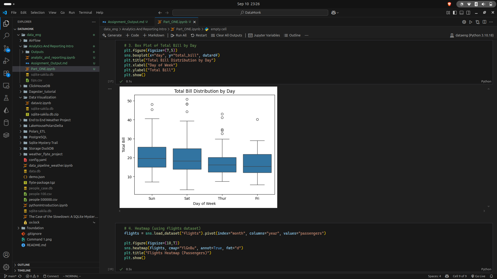
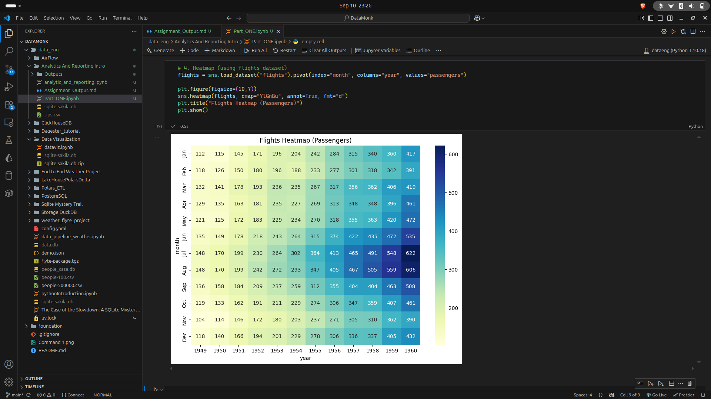

# PART 2 - Dashboarding with Apache Superset & Sakila Dataset
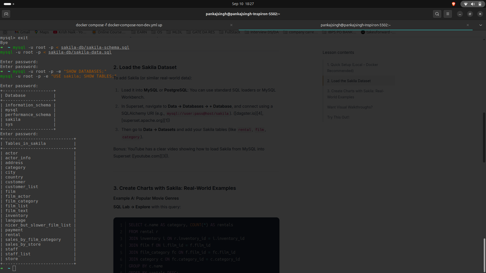
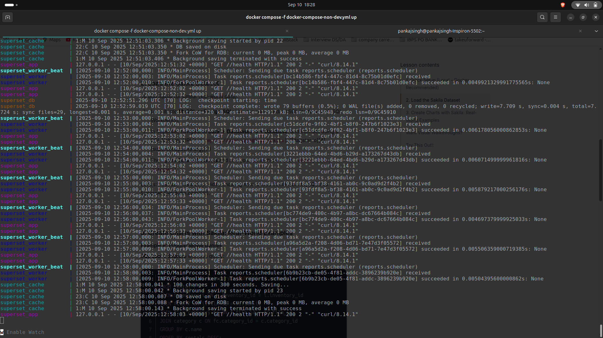

## Superset Dashboard
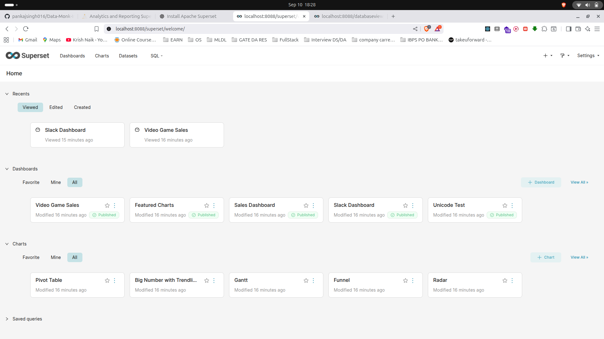

<!-- 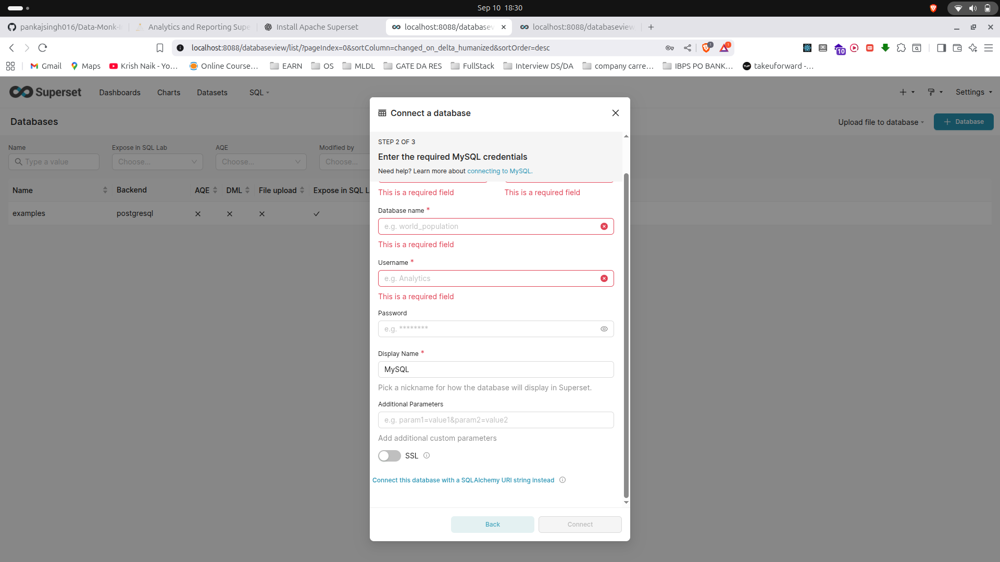 -->

## Connected the mysql-container after copying the sakila dasbhoard with it
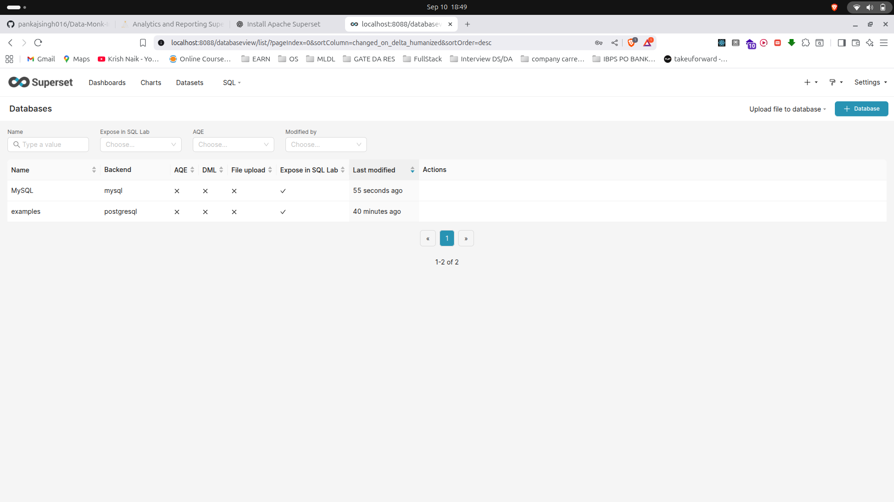
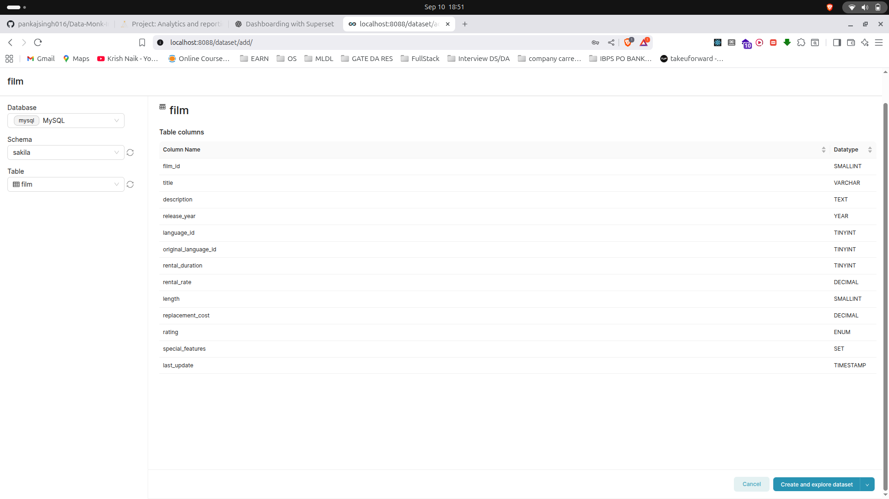

## Created the full rental_full dataset.

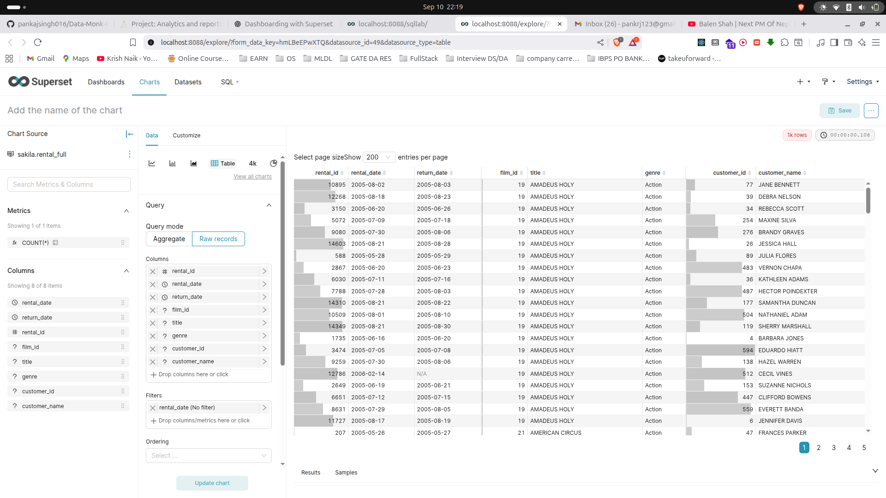

## Charts Creation
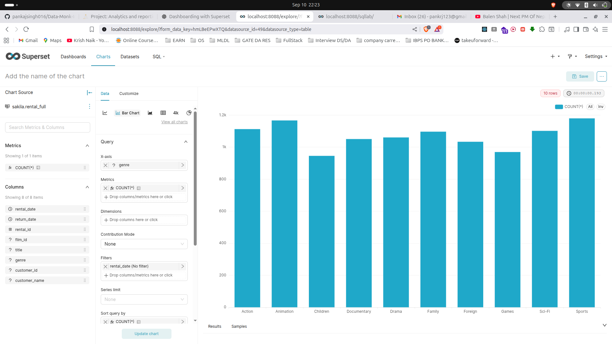

## Dashboard Building

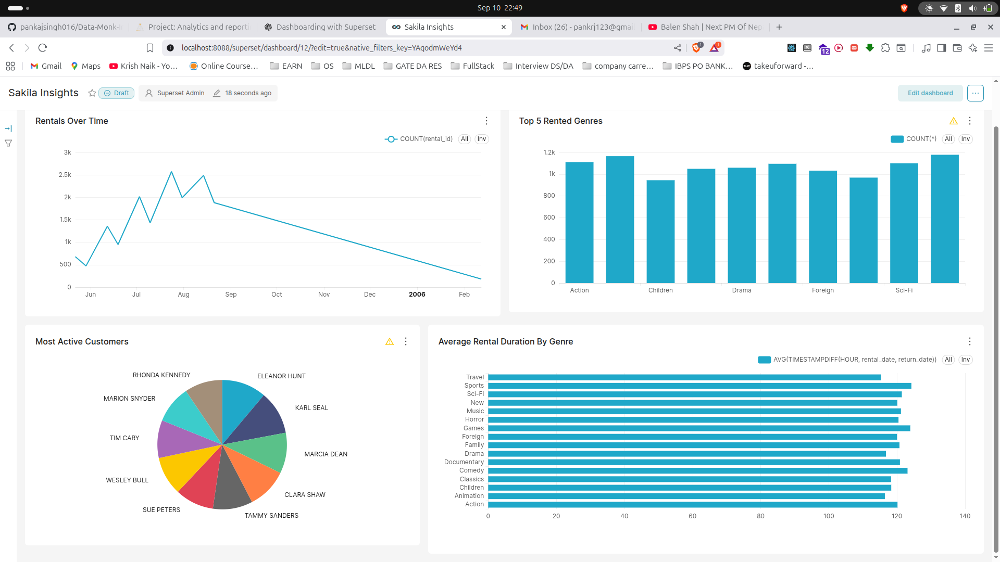