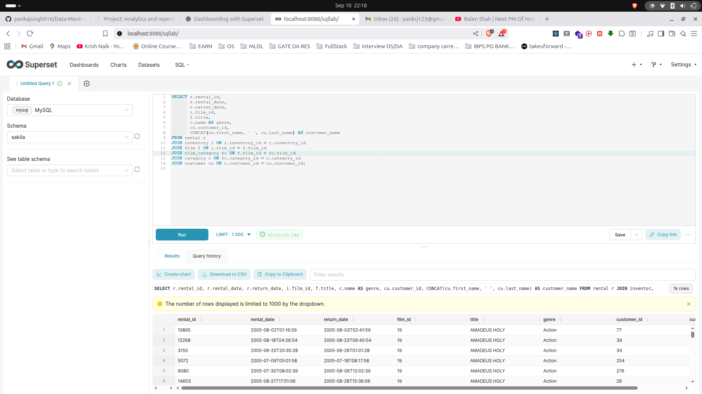
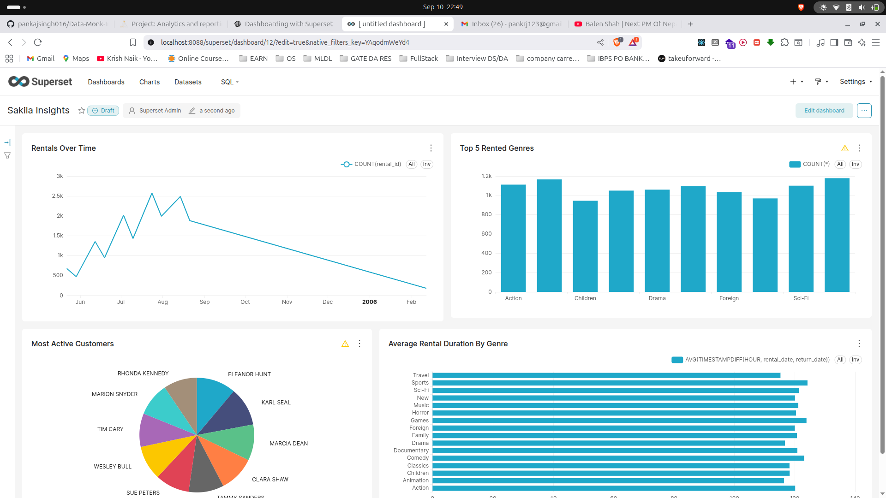

# PART 1 - Getting Started With Matplotlib & Seaborn

# PART 2 - Dashboarding with Apache Superset & Sakila Dataset

## Superset Dashboard

<!--  -->

## Connected the mysql-container after copying the sakila dasbhoard with it

## Created the full rental_full dataset.

## Charts Creation

## Dashboard Building

