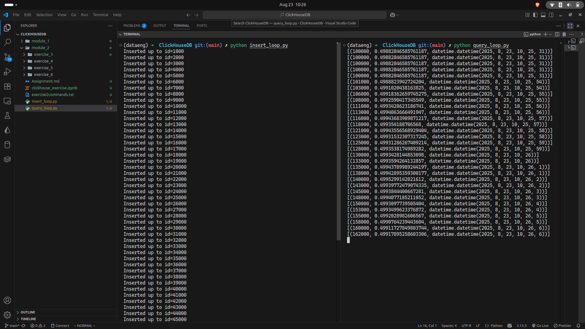

# Module 1 : Data Compression

## Exercise 1 ---- Create Two Tables: With and Without Codecs

### Output: Create two tables with same structure

### Output: Insert 1 million rows

### Output: Compare the size of each table

 
 

## Exercise 2 --- Guess the Best Codec
 
 

### Output Pick Column Type

### Output Create Test Tables

### Output Insert Sample Data

### Output Compare Disk Usage

 
 

# Module 2 : Columnar Storage
## Exercise 3 -- Compare Row vs Column Query

### Output Time Postgres

### Output Time ClickHouse

 
 

# Module 3 : Why ClickHouse is Fast
## Exercise 4 Test Isolated Inserts and Queries

### OUTPUT 

 
 

## Exercise 5 Experiment with Replacing Merge Tree
### OUTPUT

## Exercise 6 Write a Vectorized Query

### OUTPUT

