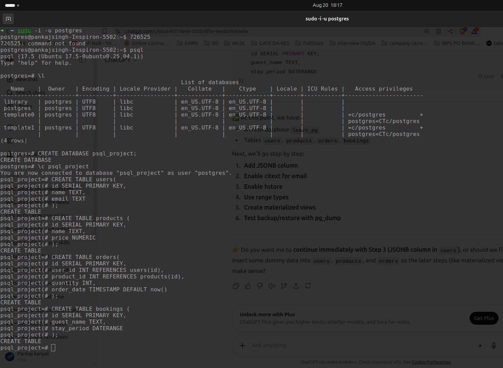
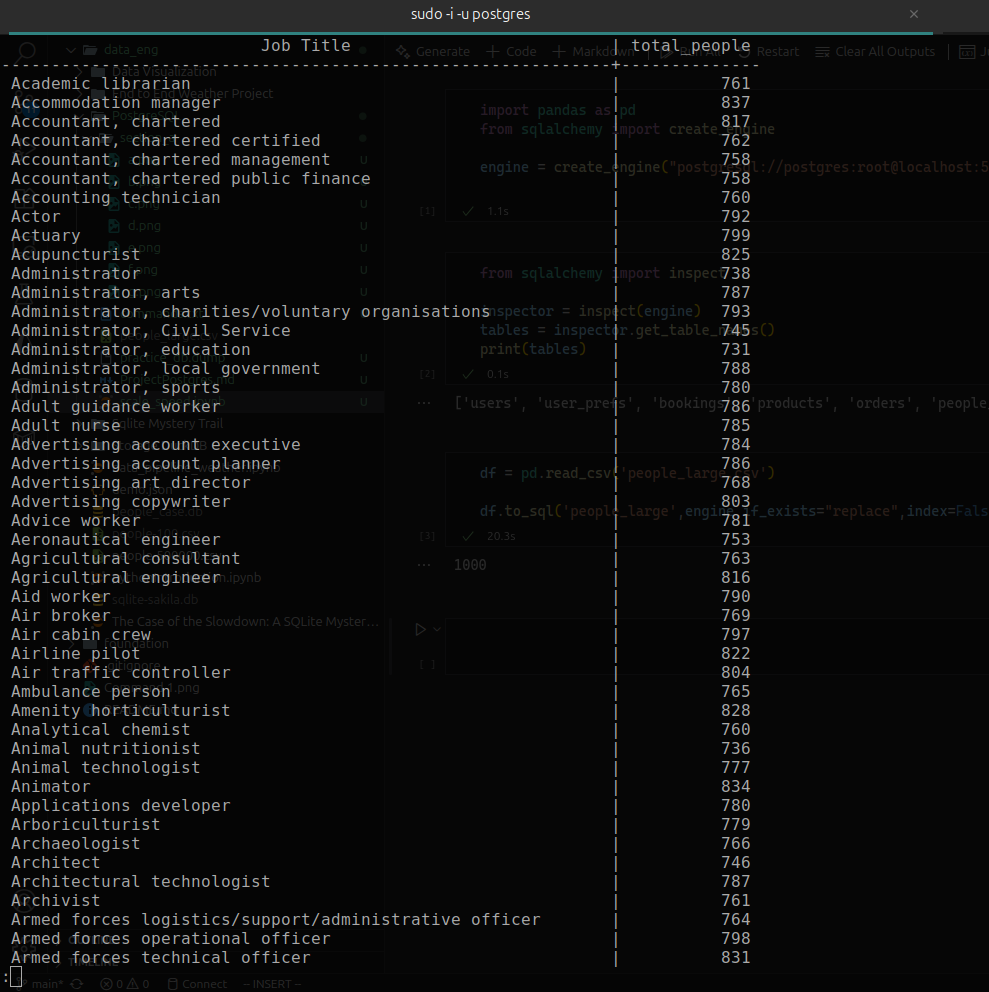

# Section 1 Use What You Learned

### Output 1

### Output 2

### Output 3

### Output 4

### Output 5

### Output 6

### Output 7

 
 

# Section 2 Scale and Speed

### Output 1

### Output 2

### Output 3

### Output 4

 
 

# Section 3 Extensions in Action

### Output 1

### Output 2

### Output 3

### Output 4

### Output 5

### Output 6

### Output 7

